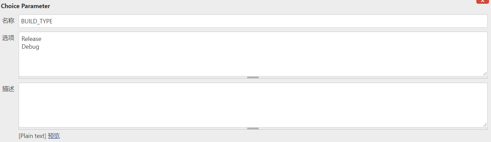
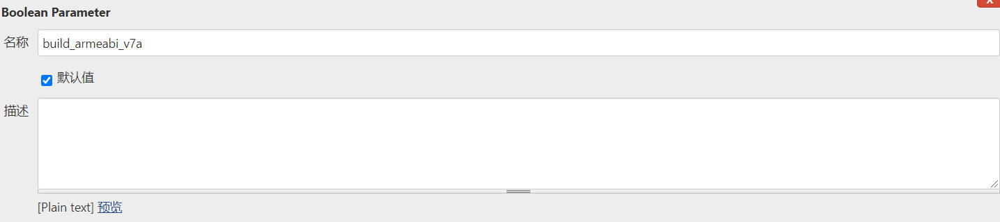
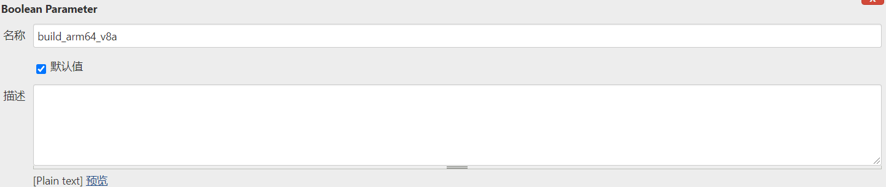
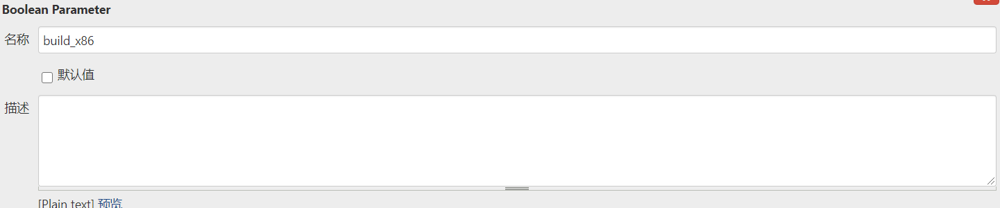
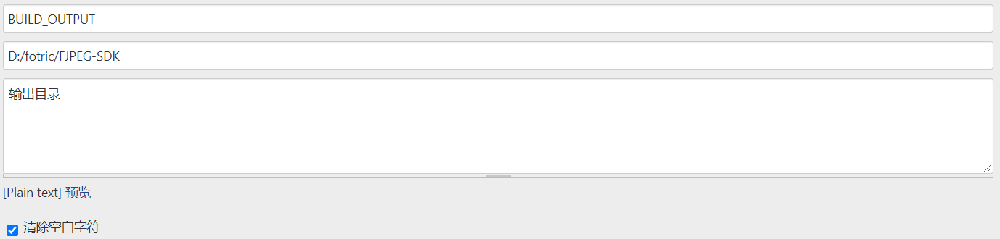
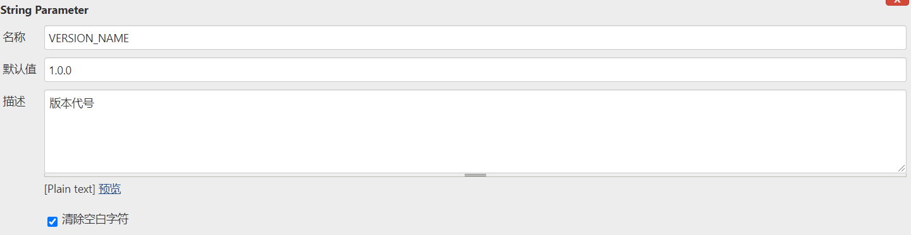
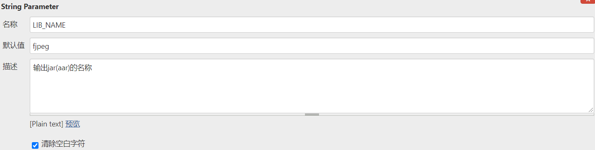

# AndroidShell

android相关shell脚本

## 1.Android SDK 自动归档脚本（Jenkins）

### 1.1 说明

 	Jenkins构建AndroidSDK后的自动归档脚本。

### 1.2 用法   

```
./jenkins/archive.sh <release/debug> <version> <outputDir>(must) <sampleModule>(default is app) <libraryModule>(default is library)
# <buildNumber> <build_armeabi_v7a> <build_arm64_v8a> <build_x86> <build_x86_64>
```

 * <release/debug> 构建类型; must

 * <version> 构建版本; must

 * <outputDir> 输出目录; must

 * <sampleModule> 示例目录; default is app

 * <libraryModule> 构建目录; default is library

 * <buildNumber> jenking构建版本号;

 * <build_armeabi_v7a> 是否构建armv7; true/false

 * <build_arm64_v8a> 是否构建armv8; true/false

 * <build_x86> 是否构建x86; true/false

 * <build_x86_64> 是否构建x86_64; true/false

### 1.3 示例

```
./archive.sh release 1.0.0 D:/fotric/FJPEG-SDK app library 27 true true true true
```

### 1.4 Jenkins中集成

1. 访问[内部Jenkins](http://192.168.10.143:8080/), 注册用户并登录;

2. Jenkins中新建项目，打开项目并添加如下配置项:

    

    

    

    

    

    

    

    

3. 源码管理中添加项目**git仓库**;

4. 将archive.sh添加到项目根目录，并添加SDK核心程序和demo程序，doc目录对应生成的SDK文档目录;

5. SDK核心程序的build.gradle文件添加如下代码：

      ```
      android {
      	def mVersionCode = getVersionCode()
      	defaultConfig{
      		//...
      		versionCode mVersionCode
              versionName VERSION_NAME
      		//...
              //aar
              setProperty("archivesBaseName", "${LIB_NAME}_v${versionName}_${getDate()}")
              //so
              if (build_armeabi_v7a.toBoolean()) 	{
              	externalNativeBuild.ndkBuild.abiFilters.add('armeabi-v7a')
              }	
              if(build_arm64_v8a.toBoolean()){
              	externalNativeBuild.ndkBuild.abiFilters.add('arm64-v8a')
              }
              if (build_x86.toBoolean()){
              	externalNativeBuild.ndkBuild.abiFilters.add('x86')
              }
              if (build_x86_64.toBoolean()){
              	externalNativeBuild.ndkBuild.abiFilters.add('x86_64')
              }
      	}
      	//...
      }
      
      def getDate() {
          def date = new Date()
          def formattedDate = date.format('yyyyMMddHHmm')
          return formattedDate
      }
      
      def getVersionCode() {
          def versionCodeFile = file('build.properties')
          if (versionCodeFile.canRead()) {
              Properties properties = new Properties()
              properties.load(new FileInputStream(versionCodeFile))
              def versionCode = properties['VERSION_CODE'].toInteger()//读取build.properties文件存放的版本号。
              def runTasks = gradle.startParameter.taskNames
              def task = 'assembleRelease'
              if (task in runTasks) {
                  properties['VERSION_CODE'] = (++versionCode).toString()
                  properties.store(versionCodeFile.newWriter(), null)
              }
              return versionCode
          } else {
              throw new GradleException("无法读取version_code.properties文件！")
          }
      }
      ```
      
5. SDK核心程序目录下添加build.properties文件，为了便于版本code管理，写入代码：
   
      ```
VERSION_CODE=1
      ```
      
7. Jenkins中给该项目添加构建步骤：

      * gradle : 

        ```
        clean assemble${BUILD_TYPE} createFullJar${BUILD_TYPE}
        ```
      
      * shell : 
      
        ```
        ./archive.sh "${BUILD_TYPE}" "${VERSION_NAME}" "${BUILD_OUTPUT}" demo library "${BUILD_NUMBER}" "${build_armeabi_v7a}" "${build_arm64_v8a}" "${build_x86}" "${build_x86_64}"
        ```
      
7. Jenkins中点击Build with Parameters, 即可完成自动构建。
   
### 1.5 注意事项

 1. 该脚本不作为项目的构建，只做项目归档操作

 2. 该脚本会**自动删除并修改demo项目中的一些文件及目录**，以确保demo的有效可用

    ```
    # delete unused dir and file
    rm -rf ${outputPathSample}/*.iml
    rm -rf ${outputPathSample}/*.md
    rm -rf ${outputPathSample}/doc
    rm -rf ${outputPathSample}/${libraryModule}
    rm -rf ${outputPathSample}/archive.sh
    rm -rf ${outputPathSample}/local.properties
    chmod u+x ${outputPathSample}/${sampleModule}/build.gradle
    chmod u+x ${outputPathSample}/settings.gradle
    chmod u+x ${outputPathSample}/gradle.properties
    sed -i "s/implementation project(path: ':${libraryModule}')//g" ${outputPathSample}/${sampleModule}/build.gradle
    echo "include ':${sampleModule}'" > ${outputPathSample}/settings.gradle
    echo -e "org.gradle.jvmargs=-Xmx1536m\nandroid.useAndroidX=true\nandroid.enableJetifier=true" > ${outputPathSample}/gradle.properties
    ```
    
2. 该脚本会自动将项目根目录下的**README.md**和**doc目录**下的所有文件合并，作为输出目录的doc，README.md的文件名会很跟doc目录下的pdf文件保持一致，**所以需要确保doc目录下有pdf版本的文档**，README.md文件中如果有图片，**请将图片放在doc/res文件夹下**，**脚本会自动将README.md中的链接doc/res/image-xxx.png替换为res/image-xxx.png**
   
   ```
   sed -i "s/doc\/res\//\/res\//g" ${outputPathDoc}/${pdfName}.md
   ```
   
   


