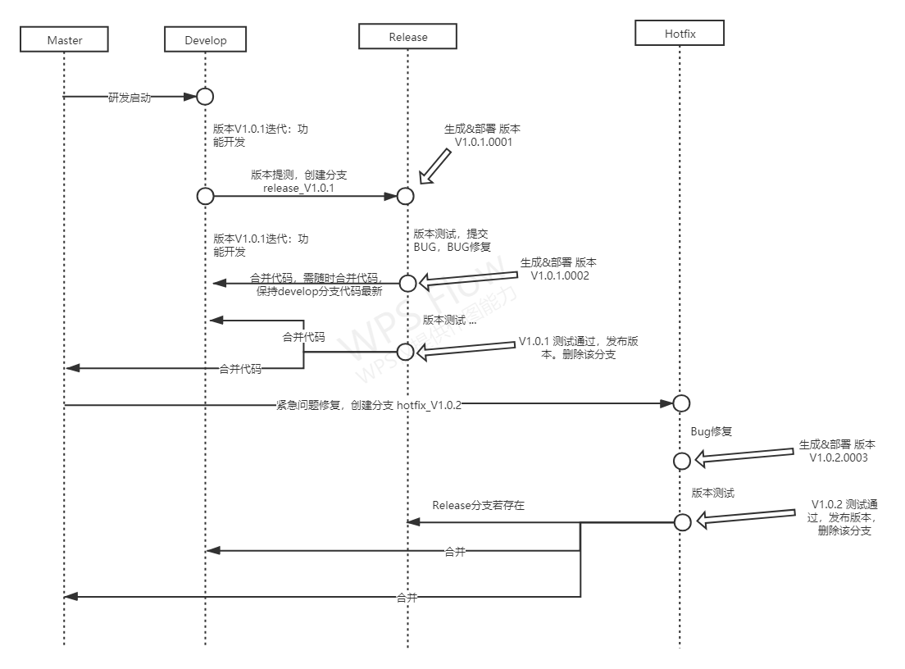

## 1. 工作流程

## 2. 分支

> - 

### 2.1 master

有且只有一个，主分支，用于代码维护保存，此分支不可进行代码编码，对于开发人员为只读，**代码管理员** 可读写，一切对于该分支的合并操作都只能由 **代码管理员** 进行，远程 **master** 不可删除。

### 2.2 develop

有且只有一个，开发分支，主要用于日常开发，日常开发包括非hotfix级别的bug修复、功能迭代和短周期的功能重构等开发任务。此分支由  **master** 分支衍生而来。可由多人协作开发，所有开发人员具备读写权限，远程 **develop** 不可删除。

### 2.3 release

包含两类：计划迭代版本、hotfix修复版本。

（1）计划迭代版本分支，最多一个，当功能开发完成，将该计划版本开始提测，从**develop**分支衍生而来，计划迭代版本，完成测试通过发布时，将该分支代码合并到 **develop** 和**master** ，并打tag标签，如果存在**refactor** 分支，同时将代码合并到**refactor**分支，计划迭代版本分支需发布到远程，支持协作。命名  release_v2.0.0。该分支开发人员可读写，不可删除，不可合并到其他分支，由**代码管理员**执行删除和合并操作。

**每一次小迭代修改内容，发布测试版本，都需合并代码到 develop 分支。**

（2）hotfix版本分支，最多一个，该分支从 **master** 分支衍生而来，完成bug修复后，再合并分支代码到  **develop** 和 **master**， 并打tag标签，如果存在**refactor** 分支，同时将代码合并到**refactor**分支，此分支需发布到远程，如果存在 release 分支，则需要同时将代码合并到release分支，支持协作。命名  hotfix_v2.0.1。该分支开发人员可读写，不可删除，不可合并到其他分支，由**代码管理员**执行删除和合并操作。

**每一次小迭代修改内容，都需同步到 develop 分支。**

### 2.4 refactor

最多只能有一个，核心重构分支，该分支开发人员可读写，不可删除，不可合并到其他分支，由 **代码管理员** 执行删除和合并操作。

重构完成，代码只可合并到 develop 分支。

### 2.5 本地分支

不做限制，由开发人员自己进行管理。

>子模块
>
>与主模块保持同样的分支管理，并且与主模块的分支一一对应。

## 3. 核心节点

> 核心节点，将作为产品开发阶段项目管理的里程碑点，作为项目管理进度管理的核心考核节点，将根据此设定计划安排进度。

### 3.1 RM

> **(Release Milestone)  版本提测点-Release**

产品开发阶段，根据产品开发规划限定每阶段版本功能开发范围，并详细列出该版本将要开发的功能列表，研发团队根据计划时间在develop分支进行该版本的功能开发，当功能开发完成后，经由团队评审，满足进入版本提测，由**代码管理员**，进行release分支创建，分支规范参考下方中定义的分支定义。代码管理员，在创建分支同时，生成该分支的测试版本和生成版本程序，测试版本提交测试进行功能测试。

### 3.2 BM 

> **(Bug Milestone )  BUG修复完成点**

产品提测发布测试版本之后，由测试人员进行测试，测试完成后，如不满足发布要求，则由开发人员进行Bug修复，BUG修复未完成后，再由**代码管理员**，进行版本发布，提交测试。同时将修复代码合并到**develop**分支。

### 3.3 PM

> **Publish Milestone 版本正式发布点**

产品提测发布测试版本之后，由测试人员进行测试，测试完成后，如满足发布要求，则将测试通过版本的生产环境版本提交生产。由**代码管理员**，同时将分支合并到**master**,**develop**分支,并打tag标签，如果存在**refactor**分支，则进行合并。

### 3.4 Hotfix1

>线上紧急修复启动点，Hotfix，创建分支进行Bug修复

产品正式发布后，发现缺陷，并确定为需要紧急修复，需要开启紧急修复版本，此版本只能用于修复待修复的紧急缺陷，不可用于增加新功能实现。由**代码管理员**，创建分支。

### 3.5 Hotfix2

>线上紧急修复提测点，当前里程点：表示对当前Hotfix版本，进行修复缺陷后，提交测试节点。

该节点表示完成缺陷修复后需要提交测试的版本，同时由**代码管理员**将该分支代码合并到**develop**分支，如果存在**refactor**和**release**分支，则同时将代码合并到这些分支。

### 3.6 Hotfix3

> 线上紧急修复版本发布点，当前里程点：表示对当前Hotfix版本，进行修复后，通过测试，则发布当前版本

该节点表示完成缺陷修复，并测试通过，进行正式版本发布，同时由**代码管理员**将该分支代码合并到**master，develop**分支，并打tag标签，如果存在**refactor**和**release**分支，则同时将代码合并到这些分支。最后删除Hotfix分支。

## 4. 客户端

不做限制，由开发人员自己进行选择。

## 5. 部署（CI）

### 5.1 部署规范

（1）部署者是针对 release/hotfix 分支。

（2）同时生成 测试环境 和 正式环境 部署程序，测试环境部署程序用于测试进行测试，测试通过之后 采用 正式环境进行生产环境部署和线上发布。

> 由于产品中涉及的云服务中包含：测试地址、正式环境和开发联调环境，在生成软件版本时，需要考虑同时生成测试环境和正式环境的应用程序。

（3）正式发布时（包括release/hotfix），完成后在 master分支打版本 tag标签，并合并代码，代码合并到master和develop分支，如果存在**refactor**分支，则同时将代码合并到这些分支，然后删除分支代码。

（4）部署都由 **代码管理员** 进行。

### 5.2 工具

#### 1. Android 平台

Jenkins(已经部署)

#### 2. Windows平台

TeamCity(已经部署)

#### 3. 后端

Jenkins(未部署)

#### 4. 前端

Jenkins(未部署)

————————

1.  是否可以全部迁移到  Jenkins 代价？
2.  是否可以全部迁移到 同一台服务器？

## 6. 代码管理员

### 6.1 Android平台

**代码管理员**：古明勇

**协作人员**：曾旭

### 6.2 Windows平台

**代码管理员**：陈凯

**协作人员**：刘志孟、曾旭

### 6.3 后端

**代码管理员**：李连坤

**协作人员**：能康亮

### 6.4 前端

**代码管理员**：张克俭