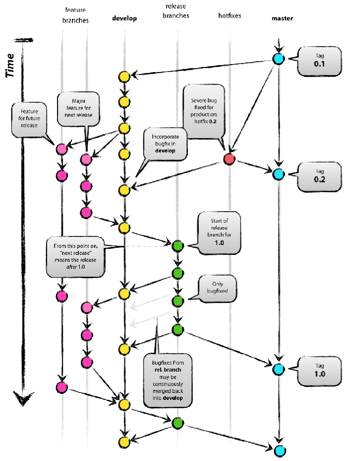
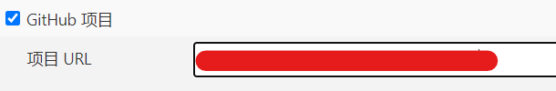
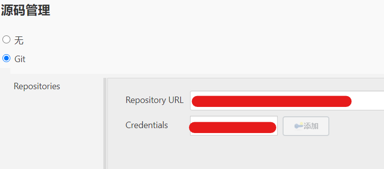
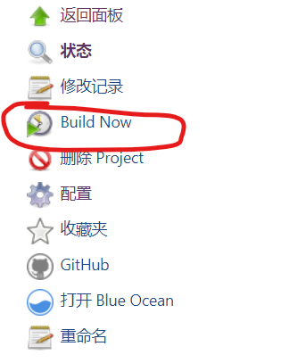
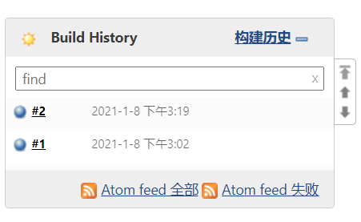

# Android WorkFlow

## 1. 说明

本文档为Fotric Android开发流程规范，包括：Git使用规范(Gitea)、CI工具使用规范(Jenkins) 等。

## 2. Git

### 2.1. 工具及环境

1. 尽可能安装较新版本的Git，唯一[下载地址](https://git-scm.com/download) ；
2. windows和macOS下，统一使用[SourceTree](https://www.sourcetreeapp.com/)作为GitGUI工具，Linux下，自行选择合适的正版GUI工具或者直接使用命令行 ；
3. 远端使用[Gitea](http://192.168.10.14:3000/)作为托管，请自行注册或联系管理员获取账号 ；

### 2.2. 工作流

统一采用 https://nvie.com/posts/a-successful-git-branching-model/ 所描述的工作流，如下图：



- master: 项目主分支（允许推送远端，需要申请权限）
- develop: 项目开发分支（允许推送远端）
- release/xxx: 新的发布分支（允许推送远端，作为测试人员在CI上自动构建使用）
- hotfix/xxx: 新的修复补丁分支（允许推送远端，作为测试人员在CI上自动构建使用）
- feature/xxx: 新的功能开发分支（不允许推送远端，只作为开发本地使用）

> 以上分支在SourceTree中均有对应。新创建的本地仓库首先需要**"选择仓库->Git工作流->初始化仓库"**来初始化工作流。

## 3. CI

### 3.1. 工具及环境

使用[Jenkins](http://192.168.10.149:8080/)作为自动化工具，请联系管理员获得登录账号。

### 3.2. 创建项目

1. 访问Jenkins并登录自己账号;

2. 创建项目，项目名称和git仓库名保持一致；

3. 绑定Git仓库；

   

4. 添加Git地址和授权；



5. 分支必须为master；

6. 构建项目；

7. 归档安装程序，复制到ftp目录（以Falcon为例 D:/APP/Falcon），目录结构为：

   ```
   |---V1.4.3.435                 V1.4.3版本安装包
   | |---Falcon_V1.4.3.435.apk	  安装包
   | |---Falcon_V1.4.3.435.udt	  安装包
   |---V1.4.4.440                 V1.4.4版本安装包
   | |---Falcon_V1.4.4.440.apk	  安装包
   | |---Falcon_V1.4.4.440.udt	  安装包
   |---V1.4.5.550                 V1.4.5版本安装包
   | |---Falcon_V1.4.4.440.apk	  安装包
   | |---Falcon_V1.4.4.440.udt	  安装包
   ```

   脚本参考：

   ```
   OUTPUT_PATH=D:/fotric/APP/Falcon
   if [ ! -d  "${OUTPUT_PATH}" ]; then
     mkdir ${OUTPUT_PATH}
   fi
   OUTPUT_PATH="${OUTPUT_PATH}/V${VERSION_NAME}"
   if [ -d "${OUTPUT_PATH}" ]; then
     rm -r ${OUTPUT_PATH}
   fi
   mkdir ${OUTPUT_PATH}
   cp -rf Release/* ${OUTPUT_PATH}/
   ```

> 最后记得清空workspace，或者设置项目权限不可view workspace。


### 3.3. 发布测试

#### 3.3.1. 新的发布版本(release/V1.0.0)

1. 完成若干新的功能(feature/xxx)开发之后，SourceTree上完成功能并合并至develop；

2. 从develop创建新的发布版本(release/V1.0.0) ；

3. 更新项目版本号，提交并推送release/V1.0.0至远端；

4. Jenkins中创建并克隆一个该项目副本项目，副本项目名称格式为: 项目名_release_V1.0.0；

   > 副本项目为临时项目，供测试人员自动构建app并做测试使用；
   >
   > 副本项目构建产物无需归档，版本正式发布后将会被删除，git上的相应分支也会被删除。

   

5. 副本项目的**源码管理**中修改git分支为release/V1.0.0；

6. 副本项目中添加测试人员账号(组)，权限只能包含：Job/Build、Job/Read；

7. 测试人员发现问题后，开发人员直接在release/V1.0.0分支上修复bug，提交并推送该分支至远端；

8. 测试人员重新生成并安装测试通过后，开发人员在SourceTree上完成release/V1.0.0 ，并推送到远端；

9. Jenkins中的主体项目监听git tag create事件后，完成自动构建并归档；

10. 删除副本项目。

#### 3.3.2. 新的修复补丁版本(hotfix/V1.0.0)

1. 从master创建新的修复补丁版本(hotfix/xxx) ；

2. 完成补丁修复，提交并推送hotfix/xxx至远端；

3. Jenkins中创建并克隆一个该项目副本项目，副本项目名称格式为: 项目名_hotfix_xxx；

   > 副本项目为临时项目，供测试人员自动构建app并做测试使用；
   >
   > 副本项目构建产物无需归档，版本正式发布后将会被删除，git上的相应分支也会被删除。

   

4. 副本项目的**源码管理**中修改git分支为hotfix/xxx；

5. 副本项目中添加测试人员账号(组)，权限只能包含：Job/Build、Job/Read；

6. 测试人员测试仍有问题，开发人员直接在hotfix/xxx分支上继续修复bug，提交并推送该分支至远端；

7. 测试人员重新生成并安装测试通过后，SourceTree上完成hotfix/xxx ，并推送到远端；

8. Jenkins中的主体项目监听git tag create事件后，完成自动构建并归档；

9. 删除副本项目。

### 3.4. jenkins构建测试版本

1.注册账号 [Jenkins地址](http://192.168.10.149:8080/)，并登录；

2.进入指定项目，选择对应的后缀带有"**_Release**"的项目，("**_Release**"的为测试专用项目，只作为测试构建版本使用)；


3.点击左侧"**Build Now**"选项开始构建，(如果有版本号，选择要构建的版本)；



4.查看构建状态，(成功:蓝色；失败:红色；灰色:被中止或遗弃)；



5.构建成功后，点击构建号进入构建页面，可以查看到对应的构建产物，选择并下载构建产物(一般为.apk、.upk、.udt)；


6.安装或更新构建产物，完成后续测试：测试不通过通知开发人员，开发完成修复后测试人员重复3-6步骤，直到测试通过。

### 3.5. 存在问题

- 2.3.1的4-6步中的**副本项目**是否可以Jenkins自动创建；
- 副本项目多次迭代创建后的版本号如何控制；
- hotfix的发布小版本号和release大版本号如何区分；
- Jenkins中的主体项目如何监听git tag create事件；
- 监听到release/V1.0.0、hotfix/xxx分支的删除事件之后，Jenkins中自动删除对应的项目副本。

## 4. 版本号

版本号格式为：4个由句点（’.’）分隔的自然数（包括0），4个数依次为主版本号(Major)、副版本号(Minor)、修订版本号(revision number)、生成序号(build number) ，例如：1.2.4.567  ，  

> 1为主版本号，通常在软件版本具有革命性变化时增长；
>
> 2为副版本号，代表了每次功能增强和优化，对应分支应为release；
>
> 4为修订版本号，代表一次修复补丁版本，对应为hotfix；
>
> 567为软件生成号，代表了每一次的生成序号。

