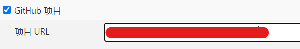
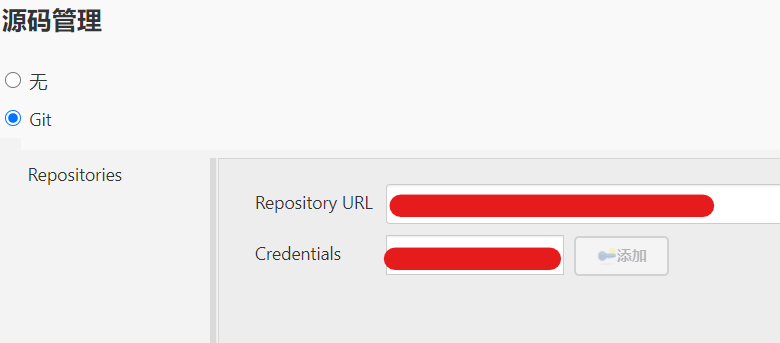
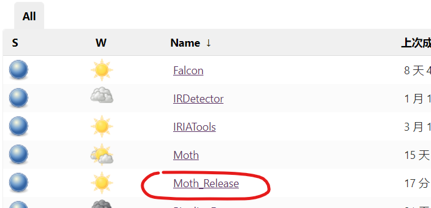
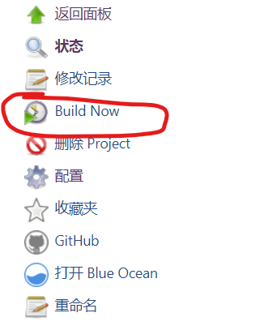
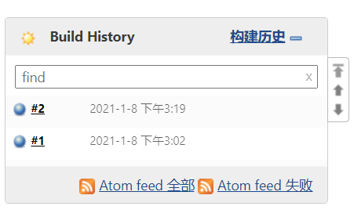
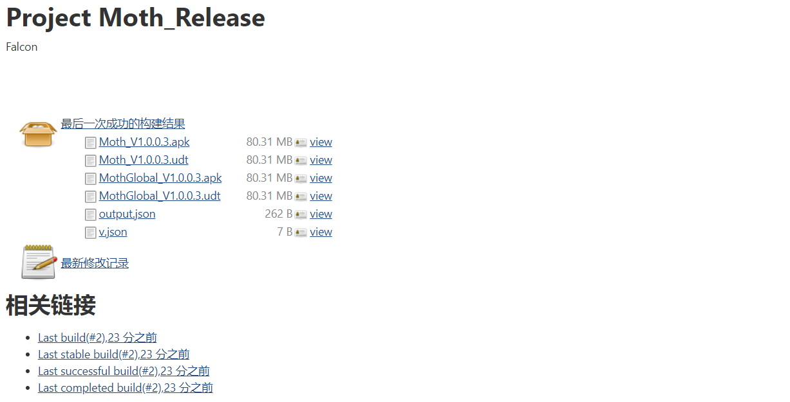

# Fotric平台软件编译和安装包制作规范

## 1. 说明

本文档为Fotric平台软件自动编译和安装包制作规范，包括：源代码的自动化编译、发布测试版本安装包(更新包)、发布正式版本安装包(更新包) 等。

## 2. 自动化编译

### 2.1. 工具及环境

使用[Jenkins](http://192.168.10.149:8080/)作为自动化工具，请联系管理员获得登录账号。

环境要求：

1. 操作系统：win10，8G(+)
2. Java(1.8.0+)
3. gradle(视具体项目而定，一般为5.6.4+)
4. Android SDK、NDK(至少要有11.2.2725575)、CMake(+)
5. Jenkins(2.233+)

### 2.2. 创建项目

1. 访问Jenkins并登录自己账号;

2. 创建项目，项目名称和git仓库名保持一致；

3. 绑定源代码Git仓库；

   

4. 添加Git地址和授权；



5. 指定要编译的源码分支；

6. 构建项目；

7. 归档安装程序，复制或上传到ftp目录（以Falcon为例 D:/fotric/APP/Falcon），目录结构一般为：

   ```
   |---V1.4.3.435                 V1.4.3版本安装包
   | |---Falcon_V1.4.3.435.apk	  安装包
   | |---Falcon_V1.4.3.435.udt	  安装包
   |---V1.4.4.440                 V1.4.4版本安装包
   | |---Falcon_V1.4.4.440.apk	  安装包
   | |---Falcon_V1.4.4.440.udt	  安装包
   |---V1.4.5.550                 V1.4.5版本安装包
   | |---Falcon_V1.4.5.550.apk	  安装包
   | |---Falcon_V1.4.5.550.udt	  安装包
   ```

   归档脚本参考：

   ```
   OUTPUT_PATH=D:/fotric/APP/Falcon
   if [ ! -d  "${OUTPUT_PATH}" ]; then
     mkdir ${OUTPUT_PATH}
   fi
   OUTPUT_PATH="${OUTPUT_PATH}/V${VERSION_NAME}"
   if [ -d "${OUTPUT_PATH}" ]; then
     rm -r ${OUTPUT_PATH}
   fi
   mkdir ${OUTPUT_PATH}
   cp -rf Release/* ${OUTPUT_PATH}/
   ```

> 最后记得清空workspace，或者设置项目权限不可view workspace。

### 2.3. 安装包生成

#### 2.3.1 内测包生成

1.注册账号 [Jenkins地址](http://192.168.10.149:8080/)，并登录；

2.进入指定项目，选择对应的后缀带有"**_Release**"的项目，("**_Release**"的为测试专用项目，只作为测试构建版本使用)；



3.点击左侧"**Build Now**"选项开始构建，(如果有版本号，选择要构建的版本)；



4.查看构建状态，(成功:蓝色；失败:红色；灰色:被中止或遗弃)；



5.构建成功后，点击构建号进入构建页面，可以查看到对应的构建产物，选择并下载构建产物(一般为.apk、.upk、.udt)；



6.安装或更新构建产物，完成后续测试：测试不通过通知开发人员，开发完成修复后测试人员重复3-6步骤，直到测试通过。

#### 2.3.2 正式包生成

Jenkins中选不带_Release的正式版项目构建即可，其余流程同2.3.1。